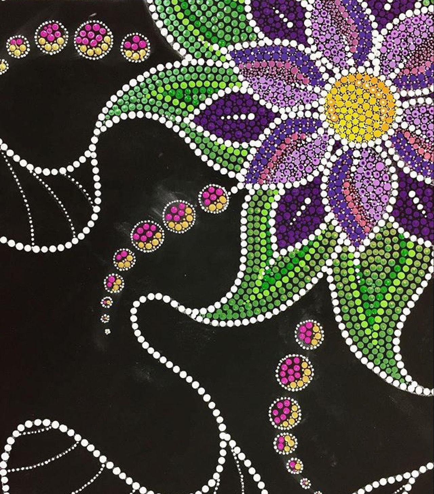
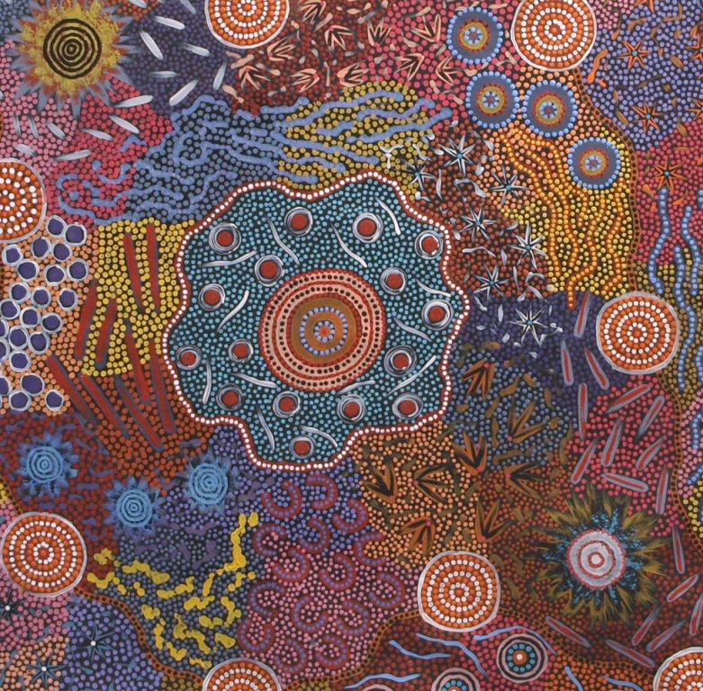
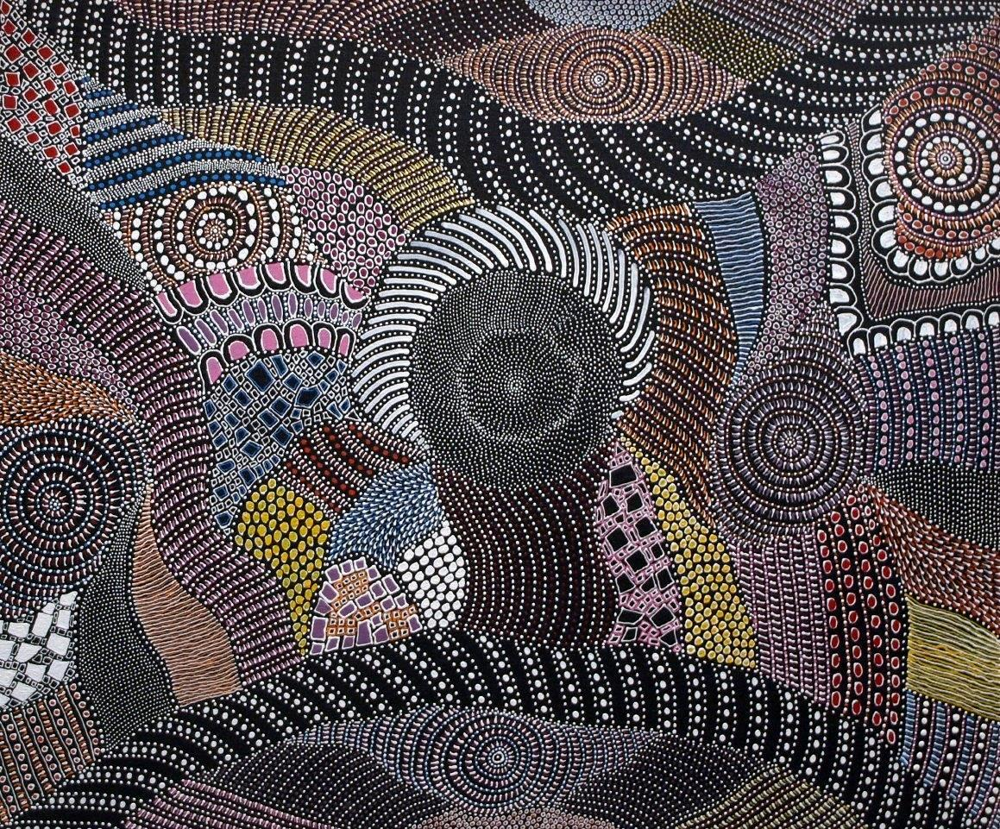

# pili0051_9103_yourTutGroup

### Imaging Technique Inspiration

##### The image I chose for my major assignment was ‘Wheels of fortune’. My Inspiration imaging technique inspiration is aboriginal dot paintings.

##### I considered incorporating vibrant and structured pointillism into my assignment. These elements provide visual rhythm and harmony, which creates an engaging, layered composition with both structural and organic design elements. It is useful when creating digital patterns or visualizations. The recurring dots and radial symmetry of the piece fit well with the potential for animation or dynamic visual displays in digital media. I think it's a useful technique for my main assignment.