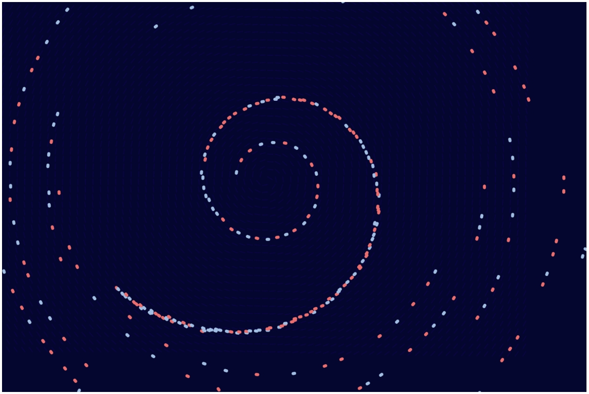

# pili0051_9103_yourTutGroup

### Imaging Technique Inspiration

##### The image I chose for my major assignment was ‘Wheels of fortune’. My Inspiration imaging technique inspiration is aboriginal dot paintings.

##### I considered incorporating vibrant and structured pointillism into my assignment. These elements provide visual rhythm and harmony, which creates an engaging, layered composition with both structural and organic design elements. It is useful when creating digital patterns or visualizations. The recurring dots and radial symmetry of the piece fit well with the potential for animation or dynamic visual displays in digital media. I think it's a useful technique for my main assignment.

### Coding Technique Exploration

##### I can use Spiral Clock Dominik in p5.js to help me achieve the desired effect. Each dot is represented by an instance of the Vehicle class. Each vehicle has Position, velocity and acceleration. I can use flow field to define the direction for movement at various locations. If I would like to steer and update each vehicle’s position every frame, it also can be achieve using flow field. These functions help me to draw each point on a dot painting and make it rotate at a certain speed and direction to achieve a dynamic effect.

[Link Text](https://openprocessing.org/sketch/2225865/#code)